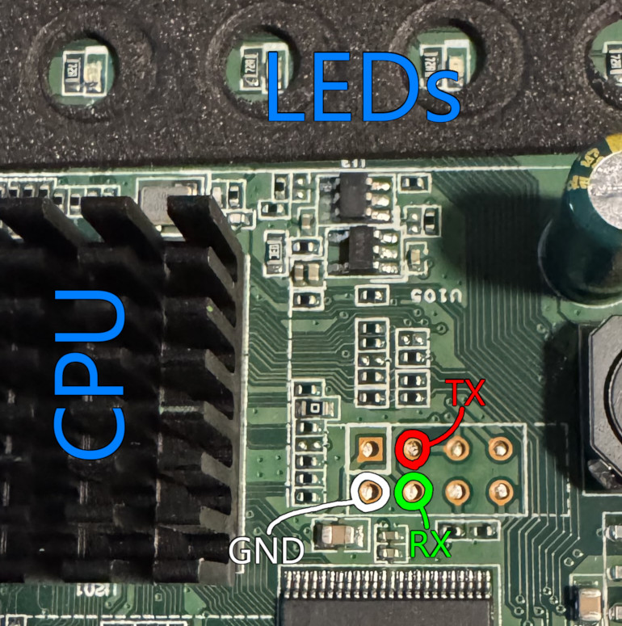

# UART on the HT818

One of the most disheartening things discovered early into playing with this device was that its UART was disabled in software. Poring over the GPL compliance releases, I found functionality hacked into both U-Boot and Linux revolving around a global variable named `uart_locked`, which completely disables the UART.

Linux-side, `uart_locked` is controlled by a cmdline argument of the same name. There does not seem to be any way to turn it on or off once the system has booted. Within U-Boot, the value is hardcoded in release builds. Its behavior extends to setting the cmdline argument for Linux, meaning that disabling `uart_locked` within U-Boot is enough to disable it in Linux.

As the HT818 has no secure boot or validation for U-Boot besides a simple checksum, reenabling the UART is a simple operation of surgical patches to the U-Boot image.

## Manually enabling the UART (1.0.31.1)

**Instructions are provided for research documentation purposes only. They are strictly relevant to the HT818 firmware version 1.0.31.1 U-Boot on `/dev/mtd1`. They will not work on any other device, and likely will not work on any other version. Do not attempt these patches if your U-Boot image does not match exactly.**

**`/dev/mtd2` is the backup U-Boot. You really should not modify it.**

Tools to automate this process are a work in progress. You should probably just wait for that.

### Dumping the U-Boot, validating the checksum

```
# nanddump -f /tmp/uboot /dev/mtd1
ECC failed: 0
ECC corrected: 0
Number of bad blocks: 0
Number of bbt blocks: 0
Block size 131072, page size 2048, OOB size 64
Dumping data starting at 0x00000000 and ending at 0x00140000...
# sha256sum /tmp/uboot
c759c44cd3403a77213b49203063ad2d37d4ada0c0f11ba8ceb778cd45796f2d  /tmp/uboot
#
```

Expected 1.0.31.1 U-Boot SHA-256: `C759C44CD3403A77213B49203063AD2D37D4ADA0C0F11BA8CEB778CD45796F2D`

`dd`ing `/dev/mtdblockXX` is **not sufficient;** the firmware image headers are not visible from them.

### Patching

The following patches are required:
- `05D0Ch`: change from `01h` to `00h` (prevents UART from being locked out in U-Boot itself)
- `613AAh`: change from `31h` to `30h` (prevents U-Boot from locking out UART in Linux)
- ~~`0001Ah`: change from `26h` to `28h` (fix up the checksum)~~
    - automate it with `gs_imgtool -f` from instead

## UART pads on board

