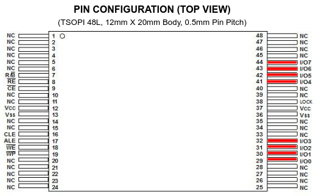

# BootROM recovery mode

the DVF101 BootROM is responsible for loading the stage 1 bootloader (referred to as "preloader" by the BootROM) from the default boot device. it knows how to initialize the UART, read from all supported boot devices, and perform secure boot validation.

## normal boot process

during a normal boot on the HT818, the BootROM reads the preloader header from the very start of NAND, then loads the preloader into ITCM at `0x08000000`. after verifying the CRC, it will pass control to the preloader, providing it with a small table of service function pointers for tasks such as secure boot validation, CRC checking, and receiving data from UART via XMODEM(!). all of this is condensed into three lines of UART output:

```
bootrom v1.0
 * trying primary boot device ...
     * checking preloader at 0x00000000... ok
```

## XMODEM recovery mode

but what if the SoC cant read the preloader from NAND? the BootROM will try a few different things (scanning at deeper offsets into NAND, reconfiguring the boot device driver) before ultimately giving up. it will then enter "recovery mode" and wait for a preloader image to be uploaded to the UART over XMODEM.

```
bootrom v1.0
 * trying primary boot device ...
     * checking preloader at 0x00000000... invalid image (009)
     * checking preloader at 0x00020000... invalid image (009)
     * checking preloader at 0x00040000... invalid image (009)
     * checking preloader at 0x00060000... invalid image (009)
     * checking preloader at 0x00080000... invalid image (009)
     * checking preloader at 0x000a0000... invalid image (009)
     * checking preloader at 0x000c0000... invalid image (009)
     * checking preloader at 0x000e0000... invalid image (009)
error! trying to reconfigure
     * checking preloader at 0x00000000... invalid image (009)
     * checking preloader at 0x00020000... invalid image (009)
     * checking preloader at 0x00040000... invalid image (009)
     * checking preloader at 0x00060000... invalid image (009)
     * checking preloader at 0x00080000... invalid image (009)
     * checking preloader at 0x000a0000... invalid image (009)
     * checking preloader at 0x000c0000... invalid image (009)
     * checking preloader at 0x000e0000... invalid image (009)
 * primary boot method failed: invalid image (009)

 * recovery mode.
   * waiting for xmodem image...
C
```

an easy way to achieve this state is by shorting pins on the NAND chip with a metallic object, causing reads to fail or return garbage. take great care to **only short pins labeled I/O**, as shorting anything else might cause permanent damage to the device.



the HT818 does not utilize secure boot, so any arbitrary image may be uploaded to the device as long as it has a valid preloader header. as a quick demonstration of this, i modified the "Bootastic" string in the Grandstream-provided preloader, fixed up the CRCs, and uploaded it to the device.

```
 * recovery mode.
   * waiting for xmodem image...
C
[18:28:45.579] Please enter which X modem protocol to use:
[18:28:45.579]  (0) XMODEM-1K send
[18:28:45.579]  (1) XMODEM-CRC send
[18:28:45.579]  (2) XMODEM-CRC receive
[18:28:46.994] Send file with XMODEM-1K
[18:28:50.616] Sending file 'bootastic_madi.bin'
[18:28:50.616] Press any key to abort transfer
..........................|
[18:28:55.861] Done
ok
madiastic v2.2.0-rc2-00219-g6a30b3d-dirty
[...]
```

## dumping the BootROM

the BootROM is 128KB and lives in mask ROM at physical address `0x00000000`, with mirrors past `0x00020000`. it should be identical between all devices based on the DVF101 platform.

i used the U-Boot command `md.b 0 20000` to read out the BootROM, and `xxd -r` to get the binary blob back from the hex dump. may be possible to dump it directly from within Linux, but i havent bothered investigating that in any depth yet.

expected DVF101 BootROM 1.0 SHA-256: `f9879cce2331b194830d3ea1c2e97310e04b63fcaeb6297c81c65895587a8a62`